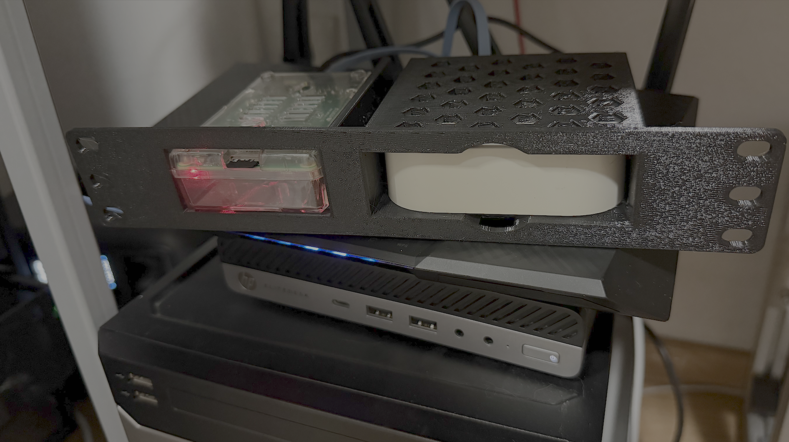

# 10" Mini Rack Raspberry Pi 3 And Philips Hue Hub
## 3D Model for a 10" Server Rack for a Raspberry Pi 3 in Case and a Philips Hue Hub

OpenSCAD project for a 10" server rack tray, made to fit a Raspberry Pi 3 + Philips Hue Hub. It might fit more models of raspberries but I don't have any to test.

Based on the sample by [Spuder on Makerworld](https://makerworld.com/en/models/1765102-10-inch-mini-rack-generator)
